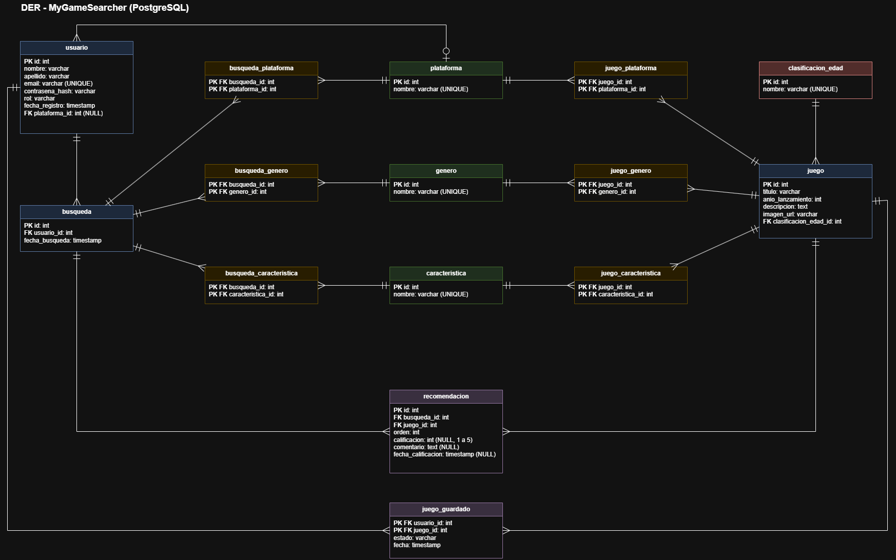
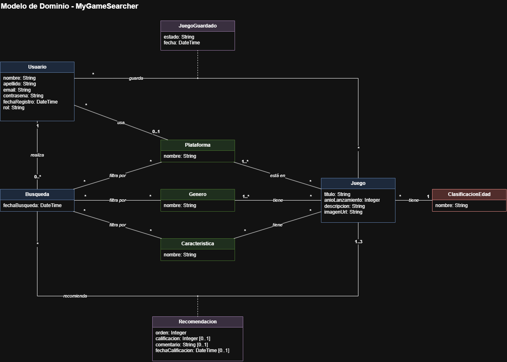

# Propuesta TP DSW - 2026

## Grupo

### Integrantes

- 53725 - Sardi Nieva, Santiago
- 52158 - Ripacolli Fuentes, Santino Jorge
- 54191 - Petazzi Cardetti, Juan Cruz

### Repositorios

- [frontend app](https://github.com/petazzijuann/mygamesearcher-frontend)
- [backend app](https://github.com/petazzijuann/mygamesearcher-backend)

## Tema

### Descripción

"DGame" es un sistema que busca asistir a _gamers_ en el momento de elección de un videojuego antes de jugar, centrándose en sus preferencias, necesidades y disponibilidad. Su propósito es reducir la fricción que tienen aquellos _gamers_ con una amplia variedad de opciones para seleccionar un juego para jugar, tanto individualmente como en grupo.

### Modelo entidad relacion

### Modelo de dominio

## Alcance Funcional

### Alcance Mínimo

**Regularidad:**

| Req               | Detalle |
| :---------------- | :------ |
| CRUD simple       | 1. CRUD Género 2. CRUD Plataforma 3. CRUD Característica 4. CRUD Clasificación de Edad |
| CRUD dependiente  | 1. CRUD Juego {depende de} CRUD Plataforma, CRUD Género, CRUD Característica, CRUD Clasificación de Edad 2. CRUD Colección {depende de} CRUD Usuario |
| Listado + detalle | 1. Listado de juegos filtrado por nombre, muestra nombre, género y plataforma => detalle CRUD Juego 2. Listado de recomendaciones personalizadas para el usuario filtrado por fecha, muestra nombre, género y plataforma del juego recomendado => detalle muestra la búsqueda realizada (filtros elegidos) y los datos del juego recomendado |
| CUU/Epic          | 1. Administrar biblioteca personal (marcar juegos como "me interesa" o "ya jugado") 2. Generar recomendación personalizada 3. Administrar colección de juegos |

**Adicionales para Aprobación:**

| Req      | Detalle |
| :------- | :------ |
| CRUD     | 1. CRUD Género 2. CRUD Plataforma 3. CRUD Característica 4. CRUD Clasificación de Edad 5. CRUD Juego 6. CRUD Usuario 7. CRUD Colección |
| CUU/Epic | 1. Administrar biblioteca personal 2. Generar recomendación personalizada 3. Administrar colección de juegos 4. Consultar historial de recomendaciones |

> CUUs relacionados entre sí: la biblioteca personal (CUU 1) es input de la recomendación (CUU 2), que no sugiere juegos ya jugados; y las recomendaciones generadas (CUU 2) son el input del historial (CUU 4).

### Alcance Adicional Voluntario

| Req      | Detalle |
| :------- | :------ |
| Listados | 1. Estadísticas personales de juegos jugados, pendientes y recomendados 2. Juegos recomendados más populares según cantidad de usuarios |
| CUU/Epic | 1. Calificar recomendación recibida |
| Otros    | 1. Exportar recomendación (PDF) |
